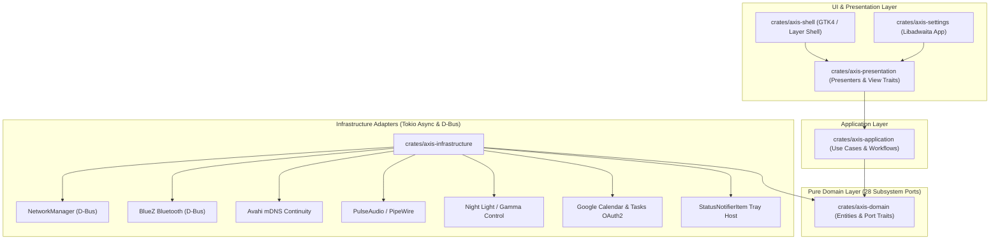

# Axis Desktop Shell

> A modern, high-performance, modular desktop shell and control center for **Wayland compositors** (such as Niri, Hyprland, and Sway), built with **Rust**, **GTK4 / Libadwaita**, and **wlr-layer-shell**.

[](https://github.com/fleischerdesign/Axis/releases)
[](LICENSE)
[](https://github.com/fleischerdesign/Axis/actions/workflows/ci.yml)

---

## Overview

**Axis** is a complete, lightweight desktop environment shell designed for modern Wayland compositors. It consists of two primary binaries:

1. **`axis-shell`:** A Wayland Layer Shell statusbar, system indicator panel, MPRIS media widget, application launcher, notification daemon interface, and quick-settings popup menu.
2. **`axis-settings`:** A native Libadwaita control center application providing system configuration for appearance, networking, bluetooth, device continuity, accounts, power, and idle behavior.

Axis is architected around **Hexagonal Architecture (Ports and Adapters)**, enforcing pure zero-dependency domain models, decoupled async infrastructure adapters, and high testability across 28 specialized domain subsystems.

---

## Key Features & Subsystems

### Axis Shell (`axis-shell`)

- **Wayland Layer Shell Integration:** Native panel overlay positioning and popup surfaces via `gtk4-layer-shell`.
- **System Indicators & Quick Settings:** Quick toggles and sliders for Wi-Fi access points, Bluetooth devices, Audio volume, Brightness, Airplane Mode, Do Not Disturb (DND), Night Light, and Power profiles.
- **Optimistic Scan Spinner Component:** Reusable 16x16px spinner providing instant visual feedback when refreshing Wi-Fi access points or Bluetooth devices.
- **MPRIS Media Player Controls:** Track metadata extraction (album art, artist, title, playback progress), play/pause toggles, and volume control.
- **Application & File Launcher:** Desktop entry parser (`.desktop`), fuzzy text scoring, icon resolution, and subprocess execution.
- **StatusNotifierItem (SNI) System Tray:** Native D-Bus tray host support for third-party application tray icons.

### Axis Settings App (`axis-settings`)

- **Appearance Settings:** Responsive `AdwClamp` layout with Light/Dark scheme cards, accent color swatches with active borders, and dynamic wallpaper picture preview.
- **Network Settings:** Connected Wi-Fi network pinning, signal strength indicators, access point list with optimistic scan button integration, and security details.
- **Bluetooth Settings:** Device discovery, paired vs. available device groups, status indicators, and empty state pages.
- **Accounts Settings:** User profile avatar integration (`avatar-default-symbolic`), account status badges (`object-select-symbolic`), and re-authentication action rows.
- **Continuity Sync:** Local peer device discovery using mDNS/Avahi, host self-filtering (`.local` trimming), cross-device clipboard sharing, and device detail views.
- **Idle & Power Settings:** Presentation mode (*Idle Inhibit*) toggle with dynamic UI group sensitivity (`sensitive(!idle_inhibit.enabled)`), lock screen timers, screen blanking, and system suspend timeouts.
- **About Settings:** System information (OS, Kernel, Compositor, GTK, libadwaita versions) and direct links to issue reporting and repository source code (`github.com/fleischerdesign/Axis`).

---

## Architecture & Domain Subsystems

Axis strictly enforces **Hexagonal Architecture (Ports and Adapters)** across its workspace crates:



### Workspace Crate Matrix

| Crate | Layer | Description | Key Dependencies |
|---|---|---|---|
| [`axis-domain`](crates/axis-domain) | Domain | Core domain entities, status models, and 28 port traits (Audio, Network, Bluetooth, Continuity, MPRIS, Tray, NightLight, IdleInhibit, etc.). | *Zero external dependencies* |
| [`axis-application`](crates/axis-application) | Application | Application workflows, use cases, and status presenters. | `axis-domain` |
| [`axis-infrastructure`](crates/axis-infrastructure) | Infrastructure | Concrete D-Bus, NetworkManager, BlueZ, mDNS, PulseAudio, Google OAuth2, and OS adapters. | `axis-domain`, `tokio`, `zbus` |
| [`axis-presentation`](crates/axis-presentation) | Presentation | Generic presenter patterns, multi-view handling, and status binding traits. | `axis-domain` |
| [`axis-shell`](crates/axis-shell) | UI / Shell | Desktop statusbar, quick settings popups, MPRIS controls, tray host, and launcher. | `gtk4`, `gtk4-layer-shell`, `axis-infrastructure` |
| [`axis-settings`](crates/axis-settings) | UI / App | Native Libadwaita configuration app for system settings. | `libadwaita`, `gtk4`, `axis-infrastructure` |

### Complete Domain Subsystems

Axis domain models are divided into 28 decoupled subsystem ports:

- `AudioPort` / `BrightnessPort` / `NightLightPort`: Hardware output controls.
- `NetworkPort` / `BluetoothPort` / `AirplanePort`: Wireless connectivity.
- `ContinuityPort`: mDNS/Avahi device peer discovery and sync (TCP 7391).
- `IdleInhibitPort` / `LockPort` / `PowerPort`: System power & session management.
- `MprisPort` / `TrayPort` / `NotificationsPort`: Desktop environment integration.
- `GoogleAuthPort` / `CalendarPort` / `TasksPort`: Cloud service integration.
- `LauncherPort` / `WorkspacesPort` / `LayoutPort` / `PopupsPort`: Shell windowing and UI state.

---

## Nix & NixOS Integration

Axis provides full Nix Flake integration for building, development environments, and NixOS configuration.

### Building & Checks with Nix

```bash
# Build default packages (axis-shell and axis-settings)
nix build .#default

# Run hermetic flake checks (clippy, formatting, workspace tests, package)
nix flake check

# Format flake.nix according to Nix standards
nix fmt
```

### NixOS System Integration

Axis exports a NixOS module (`nixosModules.default`) in `flake.nix` that automatically configures required system services for Continuity peer sync, clipboard support, and hardware permissions:

```nix
# configuration.nix
{ inputs, ... }: {
  imports = [
    inputs.axis.nixosModules.default
  ];
}
```

The module automatically configures:
- **`services.avahi`:** Enables local mDNS/DNS-SD discovery for Axis Continuity peer sync.
- **`networking.firewall`:** Opens TCP port `7391` for Axis Continuity communication.
- **`services.udev`:** Configures `/dev/uinput` permissions for system input events.
- **`environment.systemPackages`:** Installs `wl-clipboard` for Wayland clipboard support.

---

## Building & Installation

### Prerequisites

- **GTK4** (`>= 4.12`) & **libadwaita** (`>= 1.4`)
- **gtk4-layer-shell** (`>= 1.0`)
- **PulseAudio** / **PipeWire** development headers
- **Linux PAM** & **libevdev** headers
- **Rust toolchain** (2024 edition)

### Cargo Build

```bash
# Clone the repository
git clone https://github.com/fleischerdesign/Axis.git
cd Axis

# Build all workspace packages
cargo build --release

# Run Axis Shell
cargo run -p axis-shell

# Run Axis Settings App
cargo run -p axis-settings
```

---

## Development & Code Quality

To maintain codebase standards, run the following verification commands before submitting changes:

```bash
# Workspace unit & integration tests
cargo test

# Clippy lints (warnings treated as errors)
cargo clippy -- -D warnings

# Codebase formatting check
cargo fmt --all -- --check

# Hermetic Nix sandbox verification
nix flake check
```

---

## License

Axis is open-source software licensed under the terms of the [GPL-3.0 License](LICENSE).
