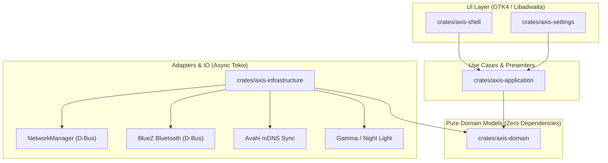

# Axis Desktop Shell

> A modern, high-performance desktop shell for the **Niri Wayland Compositor**, built with **Rust**, **GTK4 / Libadwaita**, and **Layer Shell**.

[](https://github.com/fleischerdesign/Axis/releases)
[](LICENSE)
[](https://www.rust-lang.org/)
[](https://github.com/YaLteR/niri)
[](https://nixos.org/)

---

## Features

- **Native Libadwaita Design System:** Standard GTK4 / Libadwaita interface with dark and light mode cards, accent color swatches, wallpaper picture previews, and responsive `AdwClamp` layouts.
- **High Performance & Safety:** 100% Rust (2024 Edition) with zero unsafe code in application logic and asynchronous event processing via Tokio.
- **Network & Bluetooth Control:** Built-in WiFi access point scanning with progress spinners, connected network pinning, and Bluetooth device pairing.
- **Axis Continuity:** Automatic peer discovery over local mDNS/Avahi for multi-device capabilities.
- **Axis Settings App:** Integrated Libadwaita settings application covering Appearance, Network, Bluetooth, Accounts, Continuity, Idle, and System Information.
- **Nix & Flake Native:** Reproducible builds and development environments via Nix Flakes (`nix build`, `nix develop`).

---

## Architecture

Axis strictly adheres to **Hexagonal Architecture (Ports and Adapters)**, enforcing clear separation of concerns, zero-dependency domain models, and high testability:



### Crate Structure

| Crate | Role & Description | Dependencies |
|---|---|---|
| [`axis-domain`](crates/axis-domain) | Pure domain entities, status models, and port traits. | *None* |
| [`axis-application`](crates/axis-application) | Use-case orchestration and presenter logic. | `axis-domain` |
| [`axis-infrastructure`](crates/axis-infrastructure) | D-Bus, NetworkManager, BlueZ, mDNS, and OS integration adapters. | `axis-domain`, `tokio` |
| [`axis-shell`](crates/axis-shell) | Wayland Layer Shell statusbar, launcher, and popups. | `axis-domain`, `axis-application`, `axis-infrastructure`, `gtk4` |
| [`axis-settings`](crates/axis-settings) | Native Libadwaita Control Center application. | `axis-domain`, `axis-application`, `axis-infrastructure`, `libadwaita` |

---

## Getting Started

### Prerequisites

- **GTK4** and **libadwaita** (`>= 1.4`)
- **Rust toolchain** (2024 edition)
- **Niri Wayland Compositor** (recommended target environment)

### Building with Cargo

```bash
# Clone the repository
git clone https://github.com/fleischerdesign/Axis.git
cd Axis

# Build the entire workspace
cargo build --release

# Run the shell
cargo run -p axis-shell

# Run the settings app
cargo run -p axis-settings
```

### Building with Nix Flakes

```bash
# Enter development shell with pre-configured environment
nix develop

# Build release binaries using Nix
nix build .#default
```

---

## Testing & Code Quality

```bash
# Run cargo workspace test suite
cargo test

# Run Clippy (warnings as errors)
cargo clippy -- -D warnings

# Check formatting across workspace
cargo fmt --all -- --check
```

---

## License

Axis is licensed under the terms of the [GPL-3.0 License](LICENSE).
