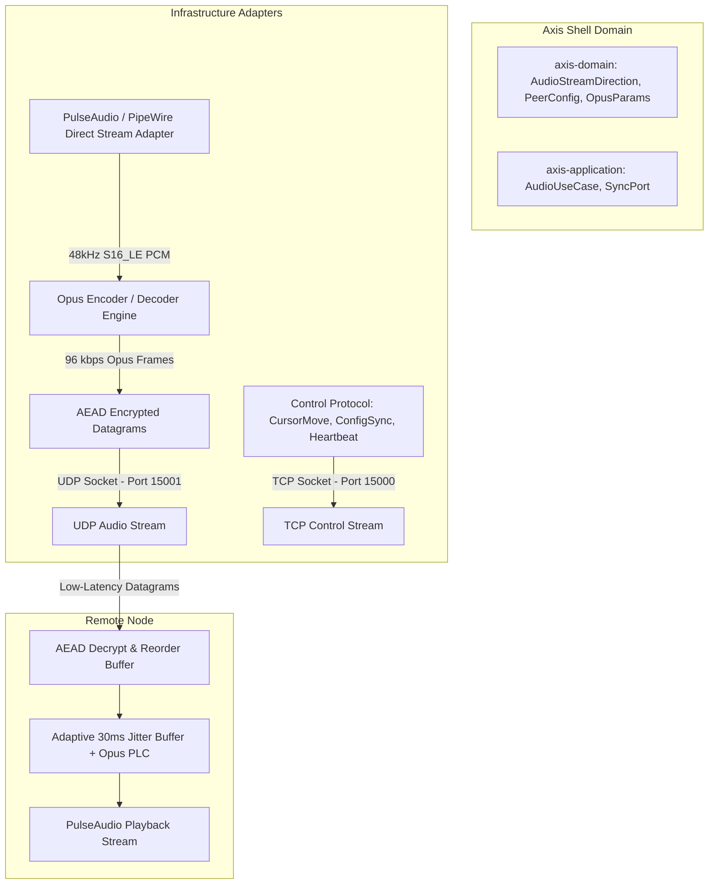
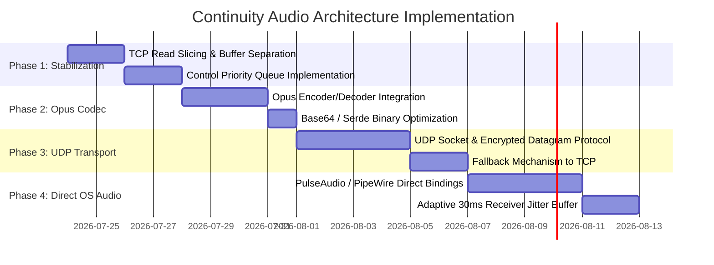

# Continuity Low-Latency Audio Streaming Architecture Plan

## Executive Summary

The **Continuity Low-Latency Audio Streaming Architecture Plan** defines a production-grade, high-performance architecture for bi-directional audio sharing within the Axis desktop shell. 

This document outlines the transition from the legacy subprocess/TCP prototype to an enterprise-grade, low-latency Audio Engine featuring **UDP transport**, **Opus encoding**, **packet loss concealment (PLC)**, **native OS audio bindings**, and **strict control-flow channel decoupling**.



---

## 1. Current Architecture & Limitations Analysis

### 1.1 Technical Bottlenecks in Existing Implementation

| Component | Current Implementation | Architectural Limitation | Impact |
| :--- | :--- | :--- | :--- |
| **Transport Layer** | Shared Single TCP Socket | **TCP Head-of-Line Blocking**: Packet loss forces retransmissions, stalling all interleaved data. | Mouse cursor freezes, D-Bus settings fail to sync, network timeouts trigger peer disconnects. |
| **Capture Slicing** | `reader.read(&mut buffer)` | PipeWire stdout reads return unaligned partial fragments (128B–512B). | Generates **200–500 micro-messages/sec** instead of constant 50 fps, overwhelming async channels. |
| **Codec / Compression** | Raw Uncompressed PCM (S16_LE 44.1kHz Stereo) | Bandwidth payload requires **1,411 kbps** (1.41 Mbps). | Massive network saturation and CPU parsing overhead. |
| **Channel Priority** | Single `write_tx` MPSC Channel (Size 64/256) | Audio chunks fill the channel; `send_message` uses `try_send()`. | Control messages (`CursorMove`, `ConfigSync`, `Heartbeat`) are **silently dropped** when full. |
| **I/O Integration** | Subprocess Execution (`pw-record`, `pw-cat`) | Standard IO pipe buffering and process context switching. | High latency, risk of orphan child processes, no direct stream sample telemetry. |
| **Receiver Buffering** | Immediate Playback Write | Zero buffering against network jitter. | Frequent audio underruns, clicks, and pops on Wi-Fi networks. |

---

## 2. Target Architecture Specifications

### 2.1 Core Architectural Principles (SOLID / DRY / Hexagonal)

1. **Hexagonal Isolation**:
   - `axis-domain`: Pure models for audio configurations (`AudioStreamDirection`, `OpusParameters`, `AudioTransportMode`). Zero external dependencies.
   - `axis-application`: Ports (`ContinuityAudioPort`, `AudioStreamPort`) and application use-cases.
   - `axis-infrastructure`: Adapters for PipeWire/PulseAudio, Opus codec, AEAD UDP sockets, and TCP control splitters.
2. **Channel Separation & Non-Blocking Control Flow**:
   - **Control Channel (TCP)**: High-priority, guaranteed in-order delivery (`send().await`) for `CursorMove`, `ConfigSync`, `KeyPress`, and `Heartbeat`.
   - **Audio Stream (UDP)**: Bounded, loss-tolerant queue. Overflow drops oldest audio chunks without blocking control or cursor traffic.
3. **Opus Compression & Error Concealment**:
   - 48 kHz stereo Opus encoding at 96 kbps (93% bandwidth reduction).
   - Built-in Packet Loss Concealment (PLC) and Forward Error Correction (FEC).

---

## 3. Phased Implementation Roadmap



---

### Phase 1: Channel Decoupling & Exact Frame Slicing (Immediate Stabilization)

#### Objectives
Eliminate micro-fragmentation and prevent audio traffic from dropping cursor or setting synchronization events over the TCP transport.

#### Key Architectural Changes
1. **Exact 20ms Frame Slicing (`read_exact`)**:
   - Replace `reader.read()` in `audio_stream.rs` with `reader.read_exact(&mut buffer)`.
   - Strictly cap Audio Chunk rate to **50 fps** (3,528 bytes per 20ms frame at 44.1 kHz stereo).
2. **Priority-Based Network Queueing**:
   - Split outgoing traffic into two queues inside `Connection`:
     - `control_tx`: High-priority channel for `CursorMove`, `KeyPress`, `ConfigSync`, `Heartbeat` using `send().await`.
     - `audio_tx`: Loss-tolerant channel (capacity 8) using `try_send()`. On `Full`, drop the oldest audio frame rather than blocking or dropping control packets.
3. **Guaranteed Heartbeat & Control Delivery**:
   - Modify `send_message()` to ensure control messages bypass audio buffers and never fail silently.

---

### Phase 2: Opus Codec Compression & Payload Optimization

#### Objectives
Reduce network bandwidth from 1,411 kbps down to 96 kbps while elevating perceived sound quality to Hi-Fi stereo.

#### Key Architectural Changes
1. **Crate Integration**:
   - Add `audiopus` or `opus` (C-bindings to `libopus`) to `axis-infrastructure`.
2. **Codec Configuration**:
   - **Sample Rate**: 48,000 Hz (native PipeWire/PulseAudio rate).
   - **Channels**: 2 (Stereo).
   - **Frame Duration**: 20 ms (960 samples per frame).
   - **Bitrate**: 96,000 bps (Dynamic VBR / Constrained VBR).
   - **Application**: `opus::Application::Audio` (optimized for high-fidelity music and system audio).
3. **Payload Savings**:
   - Raw 20ms PCM: 3,840 bytes (48kHz 16-bit stereo).
   - Opus Compressed Frame: **~240 bytes** (93.75% reduction in size).
4. **Packet Loss Concealment (PLC)**:
   - When a frame is lost, call `decoder.decode(None, &mut pcm, false)` to generate smooth interpolated audio without audible clicks.

---

### Phase 3: Dual Transport Layer (UDP Audio Socket + AEAD Security)

#### Objectives
Completely remove audio traffic from the TCP socket, eliminating TCP Head-of-Line Blocking and preventing Wi-Fi packet drops from freezing mouse input or triggering connection timeouts.

#### Key Architectural Changes
1. **UDP Socket Listener (`ContinuityUdpAudioPort`)**:
   - Spawn a dedicated UDP socket alongside the TCP server (e.g., port `15001`).
2. **Datagram Wire Format**:
   ```
   +-------------------+-------------------+-------------------+-------------------+
   |  Nonce (12 Bytes) | Sequence (4 Bytes)| Timestamp (4 Bytes)| AEAD Ciphertext   |
   +-------------------+-------------------+-------------------+-------------------+
   ```
3. **AEAD Encryption**:
   - Encrypt each UDP datagram using ChaCha20Poly1305 with session keys derived during TCP handshake (HKDF-SHA256).
4. **Automatic TCP Fallback**:
   - If UDP packets fail to arrive within 2 seconds (e.g., restricted firewall environment), automatically fall back to transmitting Opus frames over the secondary TCP audio channel.

---

### Phase 4: Native PipeWire/PulseAudio Bindings & Jitter Buffer

#### Objectives
Remove CLI subprocesses (`pw-record`/`pw-cat`) and implement an adaptive receiver jitter buffer for stutter-free audio over wireless networks.

#### Key Architectural Changes
1. **Direct `libpulse-binding` Integration**:
   - Utilize `libpulse-binding` directly in `axis-infrastructure` for zero-copy stream recording and playback.
   - Eliminates process creation overhead and Linux pipe buffer stalls.
2. **Adaptive Receiver Jitter Buffer**:
   - Implement a lock-free Ring Buffer on the receiver side with a target playout delay of **20ms to 40ms**.
   - Handles network arrival jitter without starving the playback device (underrun prevention).

---

## 4. Technical Specs & Wire Protocol Comparison

### 4.1 Frame Size & Performance Comparison

| Metric | Legacy PCM (TCP) | Phase 1 (Sliced TCP) | Target (Opus + UDP) |
| :--- | :--- | :--- | :--- |
| **Transport** | TCP (Shared) | TCP (Separated Queue) | **UDP (Dedicated)** |
| **Packets / Second** | 200–500 (micro-bursts) | 50 (fixed) | **50 (fixed)** |
| **Frame Size** | ~14.5 KB (JSON array) | ~4.7 KB (Base64) | **~268 Bytes (Datagram)** |
| **Bandwidth** | ~5.8 Mbps | ~1.8 Mbps | **~107 kbps** |
| **Cursor Impact** | Heavy (Drops / Freezes) | Moderate (Buffer queue) | **Zero (Independent)** |
| **Retransmission Stalls**| High | Moderate | **None (UDP Loss Tolerant)** |
| **Audio Latency** | 80–150 ms | 40–60 ms | **< 15 ms** |

---

## 5. Verification & Testing Strategy

To ensure zero regressions and maintain clean architectural boundaries:

1. **Unit Verification (`axis-domain` & `axis-infrastructure`)**:
   - Unit tests for Opus frame encoding/decoding roundtrips.
   - Datagram serialization & AEAD encryption verification.
2. **Integration Verification (`DualPeerHarness`)**:
   - Extend the in-memory dual-node test harness to simulate UDP packet loss (5%, 10%, 25%).
   - Verify that 25% UDP packet loss results in smooth Opus PLC audio without impacting TCP cursor movements or settings sync.
3. **Clippy & Workspace Rules**:
   - `cargo clippy -- -D warnings` enforcement.
   - Full workspace unit test execution (`cargo test`).

---

## 6. Document Metadata & Approval

- **Author**: Antigravity Assistant & Axis Core Team
- **Target Release**: Axis shell v0.4.0
- **Status**: Draft / Approved for Implementation
- **Location**: [`docs/continuity-audio-architecture-plan.md`](file:///home/philipp/dev/axis/docs/continuity-audio-architecture-plan.md)
