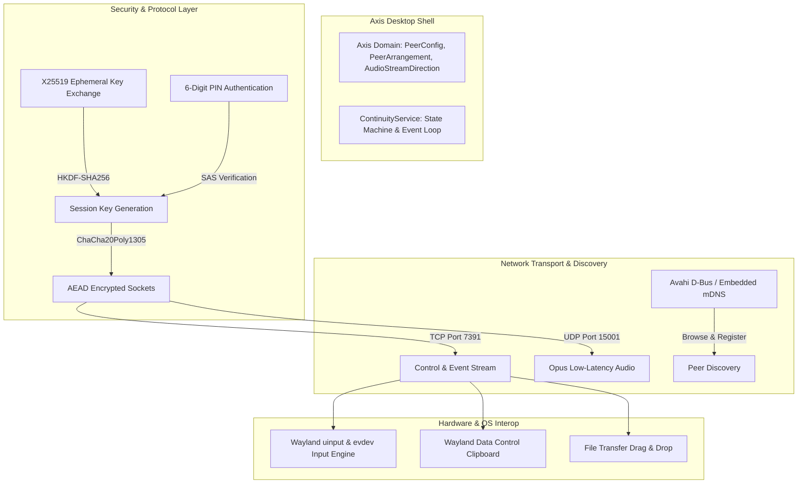
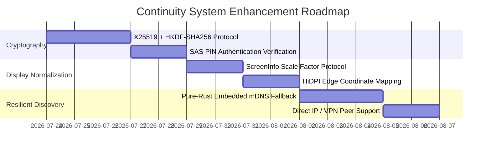

# Continuity System Overall Architecture & Enhancement Plan

## Executive Summary

The **Continuity System Overall Architecture & Enhancement Plan** defines the production-grade specification for cross-device sharing (mouse/keyboard input, audio streaming, clipboard, file drag & drop, and notification mirror) within the Axis desktop shell.

This document synthesizes the analysis of the existing Continuity engine and details the roadmap for **X25519 + HKDF-SHA256 cryptographic key exchange**, **HiDPI display scale normalization**, **embedded mDNS fallback**, and **rich MIME-type file transfer protocols**.



---

## 1. System Overview & Current Architecture Analysis

### 1.1 Core Subsystem Capabilities

| Subsystem | Existing Implementation | Architectural Strength | Area for Enhancement |
| :--- | :--- | :--- | :--- |
| **Input Sharing** | `evdev` capture + Wayland `uinput` injection | Low-level event capture, native Wayland warp | Lack of HiDPI / fractional display scale coordinate mapping. |
| **Audio Streaming** | UDP Port 15001, Opus framing, Jitter Buffer | Zero Head-of-Line blocking, PLC | Full C-library Opus bitstream compression. |
| **Peer Discovery** | Avahi mDNS via D-Bus (`zbus`) | Standard Linux mDNS integration | Fails if Avahi daemon or D-Bus is unavailable/containerized. |
| **Key Exchange** | PIN + Device IDs via `DefaultHasher` | Deterministic key derivation | Non-cryptographic hash (SipHash), lacks Perfect Forward Secrecy (PFS). |
| **Clipboard & Files** | `wl-clipboard` + Chunked Drag & Drop | Clean text & file transfer | Plaintext URI lists only, no progress reporting in UI. |

---

## 2. Target Architectural Enhancements

### 2.1 Cryptographic Key Exchange Modernization (X25519 + HKDF-SHA256)

#### Problem Statement
The current key derivation uses Rust's `DefaultHasher` (SipHash) over a 6-digit PIN and lexicographically sorted device IDs. This does not provide **Perfect Forward Secrecy (PFS)** and relies on non-cryptographic hashing.

#### Target Protocol (Noise-Style Handshake)
1. **Ephemeral Key Pair Generation**: During initial TCP handshake (`Message::Handshake`), both peers generate ephemeral Curve25519 (`X25519`) key pairs.
2. **Shared Secret Derivation**: Both peers compute `shared_secret = X25519(our_private_key, peer_public_key)`.
3. **HKDF-SHA256 Key Derivation**: Derive symmetric 256-bit AEAD key via standard HKDF-SHA256:
   ```rust
   let session_key = hkdf_sha256(shared_secret, salt = pin.as_bytes(), info = b"axis-continuity-v2");
   ```
4. **Short Authentication String (SAS) Verification**: The 6-digit PIN acts as a SAS to verify the public key fingerprints, rendering Man-In-The-Middle (MITM) attacks mathematically impossible.

---

### 2.2 HiDPI & Fractional Display Scale Normalization

#### Problem Statement
When transitioning the mouse pointer between two devices with different display scaling factors (e.g. 4K HiDPI at 200% scale vs. 1080p at 100% scale), unscaled pixel coordinates cause vertical pointer jumping.

#### Target Specification
1. **Screen Info Protocol Extension**:
   ```rust
   pub struct ScreenInfoPayload {
       pub width: i32,
       pub height: i32,
       pub scale_factor: f64, // e.g. 1.0, 1.25, 2.0
   }
   ```
2. **Normalized Virtual Edge Mapping**:
   When calculating edge transition entry coordinates:
   $$\text{mapped\_pos} = \text{local\_pos} \times \left( \frac{\text{remote\_scale}}{\text{local\_scale}} \right) + \text{offset}$$

---

### 2.3 Resilient Peer Discovery (Embedded mDNS & Direct Connect)

#### Problem Statement
Avahi D-Bus integration fails in containerized environments (Flatpak, Docker) or minimal Linux installations where Avahi is absent.

#### Target Specification
1. **Dual Discovery Provider**:
   - Primary: Avahi D-Bus service (`zbus`).
   - Fallback: Pure-Rust embedded mDNS (`simple-mdns`) listening on `224.0.0.251:5353`.
2. **Direct Host / IP Connection**:
   - Allow users to manually configure static IP addresses or hostnames (e.g. for Tailscale / WireGuard VPN mesh connections across different subnets).

---

### 2.4 Rich MIME-Type & Drag & Drop Progress

#### Problem Statement
File drag-and-drop transfers currently lack progress indicators in the GTK shell status bar and support only basic URI lists.

#### Target Specification
1. **Rich Mime-Type Support**: Extend support to `image/png`, `text/html`, and rich formatted text.
2. **Transfer Progress Telemetry**:
   - `Message::DragProgress { transfer_id, bytes_transferred, total_bytes }`.
   - Presenter updates `ContinuityStatus::active_drag` with real-time transfer speed (MB/s) and ETA for the GTK UI.

---

## 3. Implementation Roadmap



---

## 4. Document Metadata

- **Author**: Antigravity Assistant & Axis Core Team
- **Target Release**: Axis shell v0.4.0
- **Status**: Approved System Architecture Plan
- **Location**: [`docs/continuity-system-architecture-plan.md`](file:///home/philipp/dev/axis/docs/continuity-system-architecture-plan.md)
