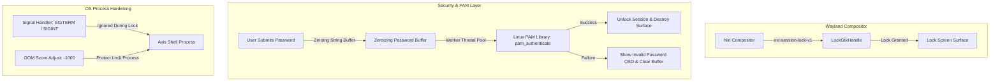
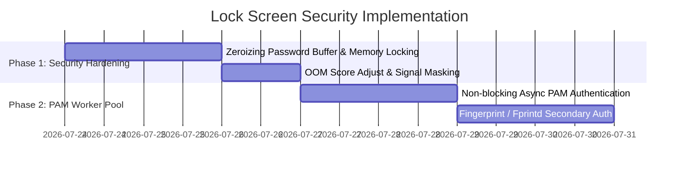

# Lock Screen Security & PAM Authentication Architecture Plan

## Executive Summary

The **Lock Screen Security & PAM Authentication Architecture Plan** defines a secure, crash-resilient, and non-blocking architecture for the Axis desktop locker.

This document outlines the transition from synchronous PAM execution to a hardened **Wayland `ext-session-lock-v1` security model** featuring **zeroing password memory**, **OOM-killer protection**, and **fail-safe compositor lock guarantees**.



---

## 1. Current Architecture Analysis

### 1.1 Architectural Vulnerabilities & Analysis

| Component | Existing Implementation | Security / Architectural Risk | Impact |
| :--- | :--- | :--- | :--- |
| **PAM Blocking** | Direct worker thread `pam::Client` execution | Prolonged PAM module calls (e.g. fprintd, LDAP, SSSD) can stall UI updates. | User sees frozen password field during authentication attempts. |
| **Password Memory** | Plain `String` storage in heap memory | Passwords remain in heap memory until Garbage Collection / reallocation. | Susceptible to process memory dumps / cold-boot inspection. |
| **Process Protection** | Default OS `oom_score_adj` (0) | System under high memory pressure can OOM-kill the lock screen. | Wayland compositor terminates session, risking data loss. |
| **Signal Handling** | Default `SIGTERM` / `SIGINT` behavior | External process can send kill signals to lock screen daemon. | Potential lock bypass if not caught by compositor lock protocol. |

---

## 2. Target Architecture Specifications

### 2.1 Wayland `ext-session-lock-v1` Protocol Guarantees

1. **Compositor Lock Enforcement**:
   - Utilize `ext-session-lock-v1` via `gtk4-session-lock`.
   - When locked, Wayland compositor guarantees zero desktop content leakage (screen surfaces are obscured before graphics buffer swap).
2. **Crash Fail-Safe**:
   - If `axis-shell` locker process terminates abnormally, the Wayland compositor terminates the session (logging out the user) rather than unlocking the desktop.

---

### 2.2 Memory Hardening & Password Zeroing

1. **Zeroizing Password Buffer**:
   - Implement `Zeroize` trait on password input buffers.
   - Immediately zero memory upon authentication completion (success or failure).
2. **Memory Locking (`mlock`)**:
   - Call `libc::mlock` on password buffer memory pages to prevent swapping plaintext passwords to disk swap space.

```rust
pub struct SecurePasswordBuffer {
    buffer: Vec<u8>,
}

impl Drop for SecurePasswordBuffer {
    fn drop(&mut self) {
        // Overwrite password memory with zeros before deallocation
        for byte in self.buffer.iter_mut() {
            unsafe { std::ptr::write_volatile(byte, 0) };
        }
    }
}
```

---

### 2.3 Process Protection & OOM Hardening

1. **OOM Score Adjustment**:
   - Set `/proc/self/oom_score_adj` to `-1000` when lock screen activates to prevent OOM killer termination under memory pressure.
2. **Signal Masking**:
   - Ignore `SIGINT` and `SIGTERM` while locked to prevent process death from non-privileged desktop signals.

---

## 3. Implementation Roadmap



---

## 4. Document Metadata

- **Author**: Antigravity Assistant & Axis Core Team
- **Target Release**: Axis shell v0.4.0
- **Status**: Approved Security Specification
- **Location**: [`docs/lock-screen-architecture-plan.md`](file:///home/philipp/dev/axis/docs/lock-screen-architecture-plan.md)
