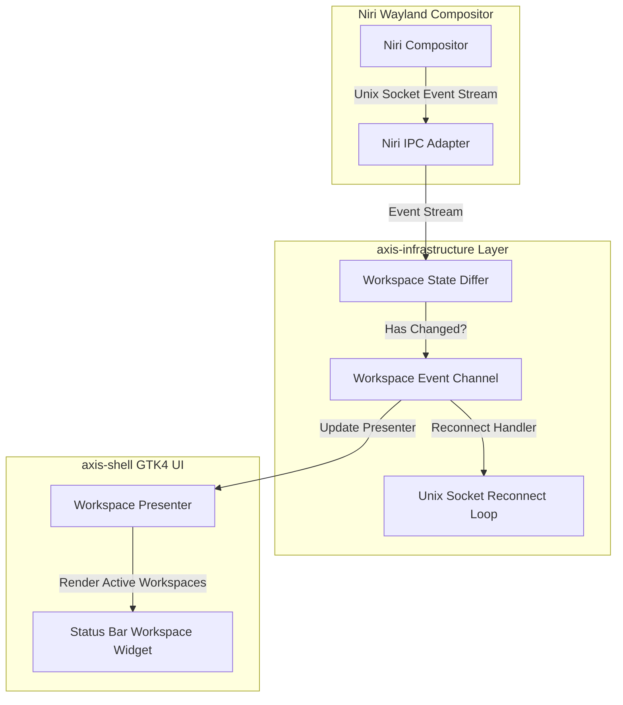
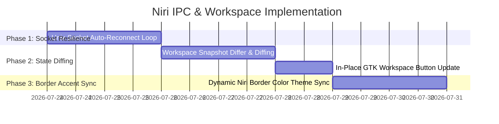

# Niri IPC & Dynamic Workspace Layout Architecture Plan

## Executive Summary

The **Niri IPC & Dynamic Workspace Layout Architecture Plan** defines a high-performance, event-driven architecture for communication between Axis desktop shell and the Niri Wayland compositor.

This document outlines unix socket reconnect resilience, workspace state diffing, and dynamic window border coloring.



---

## 1. Current Architecture Analysis

### 1.1 Technical Bottlenecks & Opportunities

| Component | Existing Implementation | Architectural Limitation | Impact |
| :--- | :--- | :--- | :--- |
| **Socket Connection** | `niri-ipc` Unix socket connection | Connection drops when Niri reloads or restarts. | Panel loses workspace state and stops updating. |
| **Workspace Rendering** | Re-renders all workspace buttons on every event | Full widget tree rebuild on minor focus change. | High CPU usage and visual flashing on fast workspace switching. |
| **Border Accent Sync** | Manual DBus IPC call to set active border color | Polling / uncoordinated theme accent sync. | Delay in updating window border colors on theme switch. |

---

## 2. Target Architecture Specifications

### 2.1 Resilient Unix Socket Reconnection Engine

Implement an automatic reconnect loop with exponential backoff for the Niri IPC event stream:

```rust
pub async fn listen_niri_events(
    event_tx: tokio::sync::mpsc::Sender<NiriEvent>,
) {
    let mut backoff = std::time::Duration::from_millis(250);
    loop {
        match niri_ipc::socket::connect().await {
            Ok(mut socket) => {
                log::info!("[niri-ipc] connected to Niri compositor socket");
                backoff = std::time::Duration::from_millis(250);
                while let Ok(Some(event)) = socket.read_event().await {
                    if event_tx.send(event).await.is_err() {
                        return; // Receiver dropped
                    }
                }
                log::warn!("[niri-ipc] event stream closed, reconnecting...");
            }
            Err(e) => {
                log::error!("[niri-ipc] failed to connect to socket: {e}, retrying in {backoff:?}");
                tokio::time::sleep(backoff).await;
                backoff = (backoff * 2).min(std::time::Duration::from_secs(5));
            }
        }
    }
}
```

---

### 2.2 Fine-Grained Workspace State Diffing

1. **State Diffing**:
   - Compare incoming `WorkspacesChanged` events with current state (`PartialEq`).
   - Only update active/inactive CSS classes on existing workspace buttons instead of destroying and recreating GTK widgets.
2. **Dynamic Border Color Sync**:
   - Subscribe to theme accent color changes and immediately update Niri active window border colors via `niri-ipc` action commands.

---

## 3. Implementation Roadmap



---

## 4. Document Metadata

- **Author**: Antigravity Assistant & Axis Core Team
- **Target Release**: Axis shell v0.4.0
- **Status**: Approved Subsystem Specification
- **Location**: [`docs/niri-ipc-workspace-architecture-plan.md`](file:///home/philipp/dev/axis/docs/niri-ipc-workspace-architecture-plan.md)
