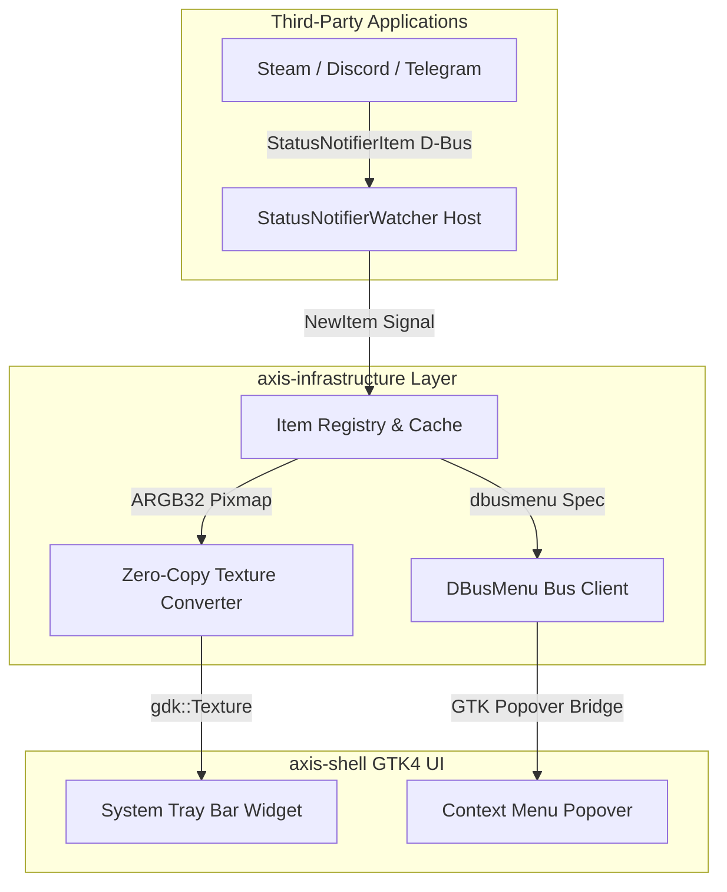
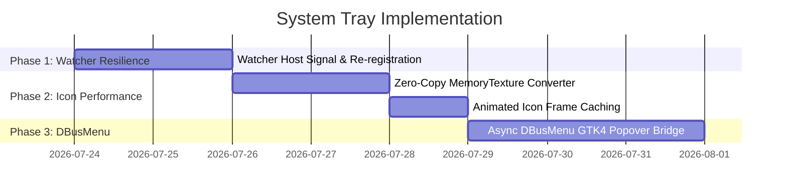

# System Tray (StatusNotifierItem & DBusMenu) Architecture Plan

## Executive Summary

The **System Tray Architecture Plan** defines a high-performance, resilient architecture for displaying third-party application tray icons (StatusNotifierItem / AppIndicator) and rendering context menus within the Axis desktop shell.

This document outlines zero-copy ARGB32 pixmap caching, async D-Bus menu rendering via GTK4 Popovers, and reliable watcher registration.



---

## 1. Current Architecture Analysis

### 1.1 Technical Bottlenecks in Existing Implementation

| Component | Current Implementation | Architectural Limitation | Impact |
| :--- | :--- | :--- | :--- |
| **Watcher Registration** | `org.kde.StatusNotifierWatcher` registration on startup | Applications started *before* Axis panel fail to register items. | Missing tray icons for autostart apps (Discord, Steam). |
| **Icon Conversion** | Converts `a(iiay)` ARGB32 raw byte arrays to GTK `Pixbuf` | Re-allocates memory buffers on every icon frame. | High CPU and memory churn for animated tray icons (e.g. Dropbox, Nextcloud). |
| **Menu Rendering** | `dbusmenu` XML / Layout tree fetching | Synchronous D-Bus calls during menu open stall GTK main thread. | UI freeze when right-clicking tray icons. |

---

## 2. Target Architecture Specifications

### 2.1 Resilient Watcher & Autostart Sync

1. **Watcher Host Protocol**:
   - Register `org.kde.StatusNotifierWatcher` on session D-Bus.
   - Emit `StatusNotifierHostRegistered` signal to prompt existing applications to re-register their tray items.
2. **Persistence Cache**:
   - Store active `StatusNotifierItem` service names in memory to recover item states if the D-Bus connection resets.

---

### 2.2 Zero-Copy ARGB32 Texture Converter

Replace `GdkPixbuf` allocations with direct `gdk::MemoryTexture` byte buffer wrapping:

```rust
pub fn convert_argb32_to_texture(width: i32, height: i32, mut pixels: Vec<u8>) -> gdk::Texture {
    // Convert ARGB32 (D-Bus spec) to BGRA32 / RGBA32 in-place without reallocation
    for chunk in pixels.chunks_exact_mut(4) {
        let a = chunk[0];
        let r = chunk[1];
        let g = chunk[2];
        let b = chunk[3];
        chunk[0] = r;
        chunk[1] = g;
        chunk[2] = b;
        chunk[3] = a;
    }
    
    let bytes = glib::Bytes::from_owned(pixels);
    gdk::MemoryTexture::new(
        width,
        height,
        gdk::MemoryFormat::R8g8b8a8,
        &bytes,
        (width * 4) as usize,
    ).upcast()
}
```

---

### 2.3 Non-Blocking GTK Popover DBusMenu Bridge

1. **Async Layout Fetching**:
   - Fetch `dbusmenu` layout tree asynchronously using `zbus`.
2. **GTK4 Popover Binding**:
   - Dynamically build `gtk4::PopoverMenu` from `gio::Menu` models derived from `dbusmenu` items.

---

## 3. Implementation Roadmap



---

## 4. Document Metadata

- **Author**: Antigravity Assistant & Axis Core Team
- **Target Release**: Axis shell v0.4.0
- **Status**: Approved System Specification
- **Location**: [`docs/system-tray-architecture-plan.md`](file:///home/philipp/dev/axis/docs/system-tray-architecture-plan.md)
