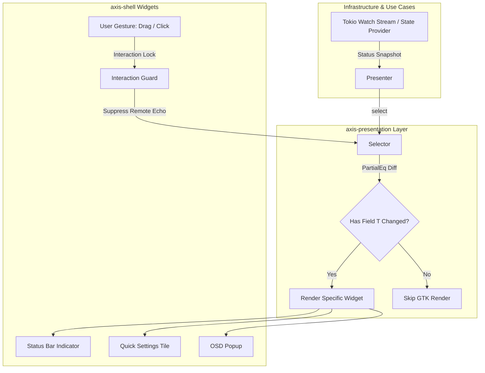
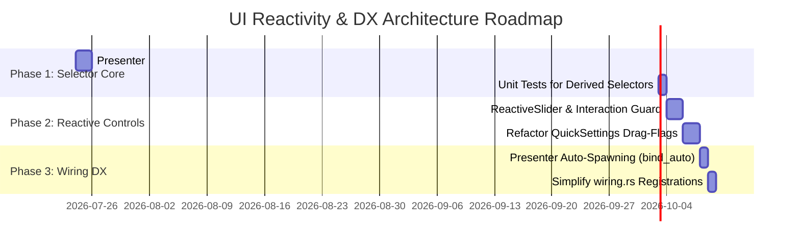

# UI Reactivity & Developer Experience (DX) Architecture Plan

## Executive Summary

The **UI Reactivity & DX Architecture Plan** defines a high-performance, developer-friendly architecture for GTK4 state management within the Axis desktop shell. 

This document outlines the transition from coarse-grained status snapshot re-rendering to **fine-grained property selectors**, **built-in interaction guards** for UI controls (sliders, toggles), and **automated presenter lifecycle management**.



---

## 1. Current Architecture Analysis

### 1.1 Architectural Strengths in Current Design

| Principle | Current Implementation | Benefit |
| :--- | :--- | :--- |
| **Hexagonal Isolation** | Domain models (`AudioStatus`, `BrightnessStatus`, `ContinuityStatus`) are pure Rust types. | Zero GTK / UI framework dependencies in `axis-domain` and `axis-application`. |
| **Deduplication** | `Presenter::run_sync()` filters identical status snapshots via `PartialEq`. | Prevents redundant GTK widget tree re-renders when state hasn't changed. |
| **One-to-Many Binding** | Single presenter can bind multiple `View<S>` traits (`add_view`). | Shared state across Top Bar, Quick Settings, and OSD without duplicated logic. |
| **Main-Thread Safety** | Streams consumed via `glib::spawn_future_local` on GTK main loop. | Eliminates thread-racing or cross-thread GTK mutation crashes. |

---

### 1.2 Identified Limitations & DX Bottlenecks

1. **Coarse-Grained Snapshot Re-rendering**:
   - `Presenter<S>` operates on the full status struct `S`.
   - *Example*: A 1% volume change in a single application triggers a full re-render of all widgets subscribed to `AudioStatus` (including sink input lists, source devices, default sink labels).
2. **Manual Gesture Echo Suppression (Slider Jumps)**:
   - When a user drags a slider (e.g. Brightness/Volume), remote state updates arriving over IPC can overwrite the user's cursor position during active dragging.
   - *Current Workaround*: Manual `Rc<Cell<bool>>` flags (`is_bright_dragging`, `is_bright_updating`) and `GestureClick` controllers in each widget file.
3. **Manual Lifecycle Registration Boilerplate**:
   - In `wiring.rs`, every presenter requires manual `glib::spawn_future_local(async move { pres.run_sync().await })` registration.

---

## 2. Target Architecture & Key Specifications

### 2.1 Fine-Grained Property Selectors (`Presenter::select`)

Instead of requiring widgets to accept the full state `S`, `Presenter<S>` supports derived **Selectors** `Presenter<S>::select<T>`:

```rust
// crates/axis-presentation/src/presenter.rs

impl<S> Presenter<S>
where
    S: Clone + PartialEq + Send + 'static,
{
    /// Creates a derived Selector Presenter that only emits when field T changes.
    pub fn select<T, F>(&self, selector: F) -> Presenter<T>
    where
        T: Clone + PartialEq + Send + 'static,
        F: Fn(&S) -> T + Send + Sync + 'static,
    {
        let parent = self.clone();
        Presenter::new(move || {
            let mut stream = (parent.subscribe)();
            let selector = selector.clone();
            Box::pin(async_stream::stream! {
                let mut prev_val: Option<T> = None;
                while let Some(status) = stream.next().await {
                    let new_val = selector(&status);
                    if prev_val.as_ref() != Some(&new_val) {
                        prev_val = Some(new_val.clone());
                        yield new_val;
                    }
                }
            })
        })
    }
}
```

#### Impact
Widgets subscribe only to the scalar or sub-struct properties they render. GTK widget updates are reduced to the absolute minimum necessary.

---

### 2.2 Built-In Interaction Guards (`ReactiveSlider` / Drag-Lock)

To solve the slider jump problem across all UI controls without ad-hoc `Rc<Cell<bool>>` flags, `axis-shell` introduces `ReactiveSlider`:

```rust
// crates/axis-shell/src/widgets/components/reactive_slider.rs

pub struct ReactiveSlider {
    pub container: gtk4::Box,
    pub scale: gtk4::Scale,
    is_interacting: Rc<Cell<bool>>,
}

impl ReactiveSlider {
    pub fn bind_presenter<S, T>(
        &self,
        presenter: &Presenter<S>,
        extract_val: impl Fn(&S) -> f64 + 'static,
        on_change: impl Fn(f64) + 'static,
    ) {
        let is_interacting = self.is_interacting.clone();
        let scale = self.scale.clone();

        // 1. User gesture interaction lock
        let gesture = gtk4::GestureClick::new();
        let lock_a = is_interacting.clone();
        gesture.connect_pressed(move |_, _, _, _| lock_a.set(true));
        let lock_b = is_interacting.clone();
        gesture.connect_released(move |_, _, _, _| lock_b.set(false));
        scale.add_controller(gesture);

        // 2. Incoming state update (suppressed during active dragging)
        let scale_update = self.scale.clone();
        let lock_state = self.is_interacting.clone();
        presenter.select(extract_val).add_view(FnView::new(move |val| {
            if !lock_state.get() {
                scale_update.set_value(*val);
            }
        }));

        // 3. User value change handler
        let lock_on_change = self.is_interacting.clone();
        scale.connect_value_changed(move |sc| {
            if lock_on_change.get() {
                on_change(sc.value());
            }
        });
    }
}
```

#### Impact
Eliminates boilerplate in `quick_settings.rs` and guarantees zero UI jumping during slider drags across the entire desktop shell.

---

### 2.3 Automated Presenter Lifecycle (`bind_auto`)

Simplify `wiring.rs` by allowing presenters to automatically spawn their background synchronization task upon binding:

```rust
impl<S> Presenter<S>
where
    S: Clone + PartialEq + Send + 'static,
{
    /// Registers a view and automatically spawns run_sync on the GTK main loop.
    pub fn bind_auto(&self, view: Box<dyn View<S>>) {
        self.add_view(view);
        let pres = self.clone();
        glib::spawn_future_local(async move {
            pres.run_sync().await;
        });
    }
}
```

---

## 3. Phased Implementation Roadmap



---

## 4. Document Metadata

- **Author**: Antigravity Assistant & Axis Core Team
- **Target Release**: Axis shell v0.4.0
- **Status**: Approved Architecture Specification
- **Location**: [`docs/ui-reactivity-architecture-plan.md`](file:///home/philipp/dev/axis/docs/ui-reactivity-architecture-plan.md)
